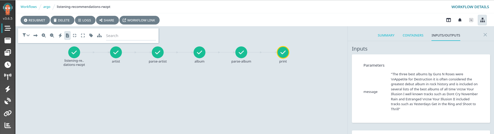

# Running Workflows

Running a workflow of containerized agents using Argo

## Prereqs

* Kubernetes cluster
* kubectl and/or argo CLI
* The sample Bee and Crew agent images built and deployed

## Getting started

### Install Argo workflows

For local testing, we'll use a quick-start install (production deploys should use the full version):

```bash
kubectl create namespace argo
kubectl apply -n argo -f https://github.com/argoproj/argo-workflows/releases/download/v3.6.5/quick-start-minimal.yaml
```

You'll also need to add the `argo` service account to the `executor` rolebinding.

```bash
kubectl edit rolebinding -n argo executor-default -o yaml
```

Final result should look something like this (last two lines are what need to be added):

```yaml
piVersion: rbac.authorization.k8s.io/v1
kind: RoleBinding
metadata:
  annotations:
  name: executor-default
  namespace: argo
roleRef:
  apiGroup: rbac.authorization.k8s.io
  kind: Role
  name: executor
subjects:
- kind: ServiceAccount
  name: default
- kind: ServiceAccount
  name: argo
```

### Create an Argo workflow

Create a workflow using [Argo](https://argo-workflows.readthedocs.io/en/latest/walk-through/)

For an example, see [agent-workflow.yaml](agent-workflow.yaml)

### Run the workflow

Using kubectl

```bash
kubectl create -n argo -f agent-workflow.yaml
```

Using [argo cli](https://argo-workflows.readthedocs.io/en/latest/walk-through/argo-cli/)

```bash
argo submit -n argo --watch agent-workflow.yaml
```

### View the dashboard

If running locally, expose the Argo dashboard service:

```bash
kubectl port-forward -n argo svc/argo-server 2746
```

Access http://localhost:2746 via browser


